[](https://github.com/vsimakhin/web-logbook/releases)
[](https://github.com/vsimakhin/web-logbook/releases)
[](https://hub.docker.com/r/vsimakhin/web-logbook)
[](https://hub.docker.com/r/vsimakhin/web-logbook)

# Web-logbook

Web-logbook is a simple, free and open-source EASA-style logbook application written in Go and React.

It lets you record and manage flight records, track licenses and certifications, visualize flights on a map, attach documents, and export a fully formatted EASA-style PDF logbook you can print, sign, and use as a regular paper logbook.

The application is a single binary and stores data locally using SQLite by default.

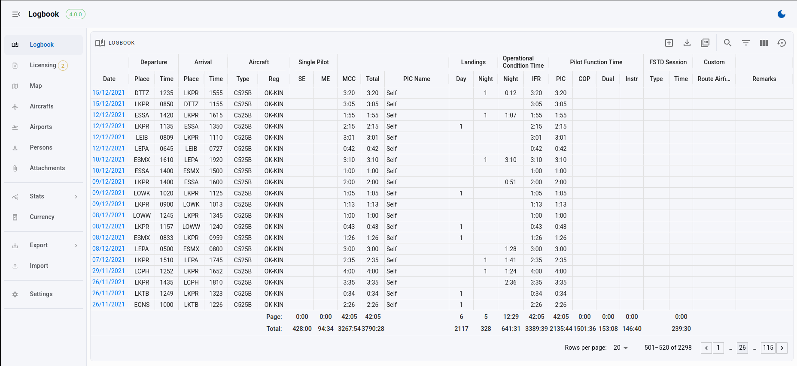

Why this project? Web-logbook was created to provide a simple, self-hosted logbook that follows EASA-style formatting while keeping full control of your data. Web-logbook runs locally and does not require a subscription or external services. Built by pilots for pilots.

---

## Quick Start

- Download the latest release and run the binary
- Then open your browser and type `http://localhost:4000`
- Voilà! You have your logbook ready to use!

The application will automatically create a local SQLite database on the first start.

---

# Table of Contents

- [Features](#features)
- [Changelog](#changelog)
- [Usage](#usage)
  - [Docker & Kubernetes](#docker--kubernetes)
  - [CLI options](#cli-options)
- [Supported Operating Systems and Requirements](#supported-operating-systems-and-requirements)
- [Interface](#interface)
- [Airports Databases](#airports-databases)
- [Advanced Configuration](#advanced-configuration)
- [API](#api)
- [Contributing / New features / Issues](#contributing--new-features--issues)
- [Contributors](#contributors)
- [Tech stack](#tech-stack)
- [License](#license)

---

# Features

- EASA-style flight logbook
- Export logbook to PDF (A4 and A5 formats)
- Flight map with route visualization
- Automatic night-time calculation
- Aircraft, airports, and persons management
- License and certification tracking
- CSV import and export
- Attachments for flight records
- Custom user-defined fields
- Dashboard statistics and currency tracking

---

# Changelog

## [Unreleased]

- Fix: error on backend for MariaDB SQL server.

## [4.1.0] - 15.03.2026

- Update: Golang and npm packages/security patches.
- Update: If filters are applied to the table, the CSV export will only export the filtered rows.
- New: Added "Save Map as PNG" button for the flight maps.

## [4.0.1] - 08.03.2026

- Fix: proper json parse/stringify for custom fields.
- Update: performance optimizations for the `Flight Record` and `Map` pages.

## [4.0.0] - 04.03.2026

All changes for v4 release:

- New: Custom DataGrid component based on standard MUI X DataGrid to replace unsupported Material React Table. This introduces new views for tables, filters, and column selection, which work faster and require less code and resources. The only disadvantage: it lacks row grouping, so the Stats by Year page had to be refactored with a new view.
- Update: Latest versions of MUI libs and components.
- Update: The previous two bullet points enabled slight style updates across the app; dark mode is updated and mobile view is now slightly more user-friendly.
- New: Added phone, email, and remarks fields for Persons.
- Update: Golang updated to 1.25.x.
- Update: Refactored Filter panel layout. Map Settings and Dashboard Settings are now separate components.
- Update: Added option to hide airport codes on the map and added new pin icon.
- New: For advanced users, added SQL view `logbook_stats_view` for flight statistics. Dates are converted to ISO format, departure/arrival times include dates, and time fields are cast to minutes. Also added API endpoint `/api/logbook/stats-data`.
- New: Added a new setting `Self PIC Label` to allow user to change the label used when PIC. By default it is `Self`, but can be changed to any other value (e.g. `SELF` according to [AMC1 FCL.050, section i, subsection 5](https://www.easa.europa.eu/en/document-library/easy-access-rules/online-publications/easy-access-rules-aircrew-regulation-eu-no?page=5#_Toc512863430)).
- New: Added aircraft registration filter on the Flight Record page if the aircraft model/type is selected.
- New: Added record number column to the Logbook table (hidden by default). Can be used in the filter panel in case you need to calculate totals for specific range of the records.
- New: Added night landings recalculation on import. If night time recalculated option is selected and it is more than 0 minutes, then night landings are set to the same value as day landings (if day landings > 0).
- New: Added a new setting `Logbook totals view` to allow user to change the way totals are displayed in the Logbook table. There are 2 options. `Standard` will show you the current page totals and grand totals through the whole logbook. `Paper Logbook` will show you the totals for each page, previous page and the totals will be a summary of these 2 values.
- New: Added custom import profiles. User can save custom import profiles and load them later. The custom profile is stored in the browser's local storage and is not shared between different browsers or devices.
- New: Attachments entity, allows to go through the list of all attachments, preview and download them (filtered or all) as a zip file.

The full changelog is [here](https://github.com/vsimakhin/web-logbook/blob/main/CHANGELOG.md)

## Old v3.x version
If you still would like to use v3.x version:
* Latest v3 release https://github.com/vsimakhin/web-logbook/releases/tag/v3.23.0
* Docker `docker pull vsimakhin/web-logbook:v3.23.0`

---

# Usage

## Local installation

You can clone the repo and compile the binaries yourself, or just download the latest ones for your operating system from the [releases](https://github.com/vsimakhin/web-logbook/releases).

1. Download the latest release from https://github.com/vsimakhin/web-logbook/releases
2. Extract the archive to a directory of your choice
3. Start the application
  * Windows:
    * Double-click on the `web-logbook.exe`.
  * Linux/macOS:
    * Open a terminal and navigate to the directory
    * Run `./web-logbook` or double-click on the `web-logbook` file.
4. Open your browser, type http://localhost:4000 and the application is ready to use
5. To close the application, press `Ctrl+C` in the terminal window or just close it

**Note**: Windows and macOS may display a security warning because the binary is not digitally signed. You can safely allow it to run.

## Docker & Kubernetes

For a quick start using Docker:
```sh
docker run -p 4000:4000 vsimakhin/web-logbook:latest
```
Check the [readme](./docker/README.md) for more details and Kubernetes deployment.

## CLI options
```sh
$ ./web-logbook -h
  -cert string
      certificate path (default "certs/localhost.pem")
  -disable-authentication
      Disable authentication (in case you forgot login credentials)
  -dsn string
      Data source name {sqlite: file path|mysql: user:password@protocol(address)/dbname?param=value} (default "web-logbook.sql")
  -enable-https
      Enable TLS/HTTPS
  -engine string
      Database engine {sqlite|mysql} (default "sqlite")
  -env string
      Environment {dev|prod} (default "prod")
  -key string
      private key path (default "certs/localhost-key.pem")
  -port int
      Server port (default 4000)
  -url string
      Server URL (default empty - the app will listen on all network interfaces)
  -version
      Prints current version
```

---

# Supported Operating Systems

Since the application is written in Go, it can run on any operating system after compiling the source code.

Prebuilt [binaries](https://github.com/vsimakhin/web-logbook/releases/latest) are available for Linux, macOS and Windows for x86_64 and ARM architectures.

You can access the application using any modern browser with JavaScript enabled.

---

# Interface

## Logbook
- Flight records table with filter for all fields and global search through all data
- Customizable columns
- Quick export to CSV
- Export to PDF (A4, A5) formats
- Automatic totals and subtotals calculation


- Dark mode and mobile friendly

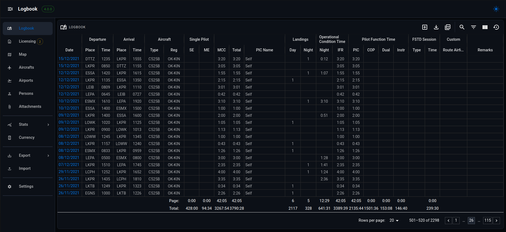
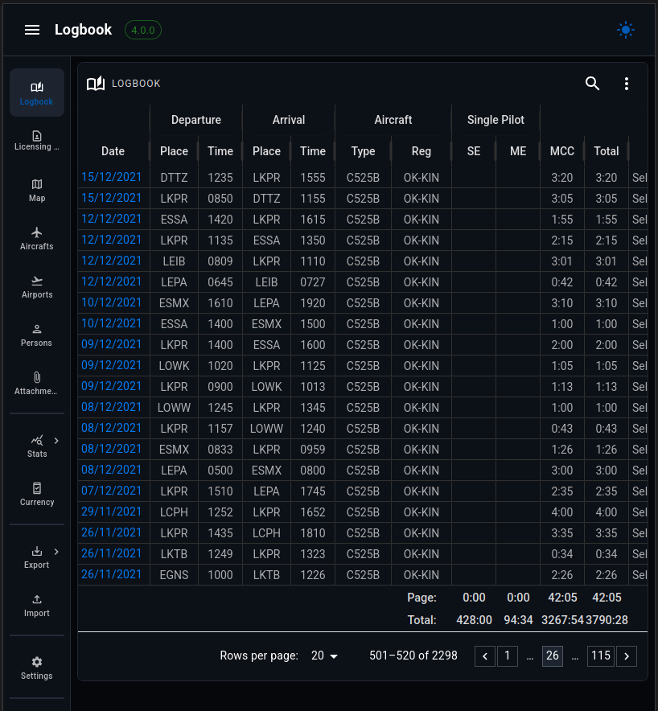


## Flight Records
- Flight record details
- Attachments
- Automatic night-time calculation
- Custom/user defined fields
- Flight map
- KML and GPX track attachments support for SkyDemon and FlightRadar24 (check this tool [fr24-kml-splitter](https://github.com/morremeyer/fr24-kml-splitter) for flightradar24 tracks)
- Persons tracking
- Instructor/Examiner signature

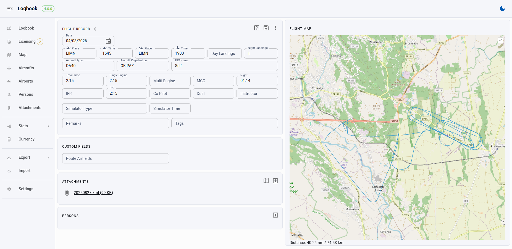

## Licensing & Certification
- Licenses and certificates
- Document attachments and preview
- Expiration tracking

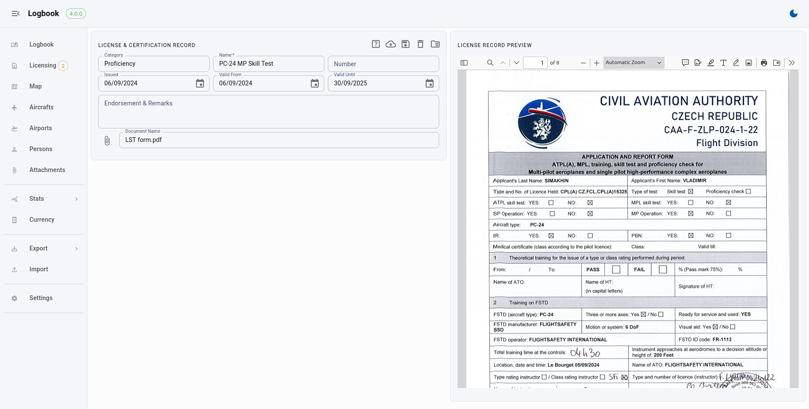

## Map
- Flight map
- Date filters
- Routes and airports filters
- Aircraft filters
- Basic statistics

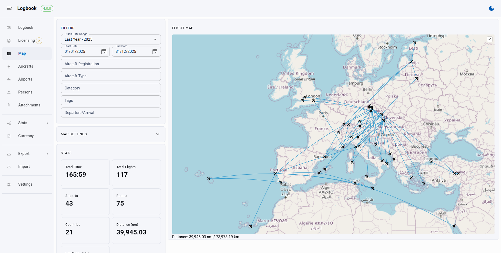

## Aircrafts
- Aircraft list
- Types
- Custom categories

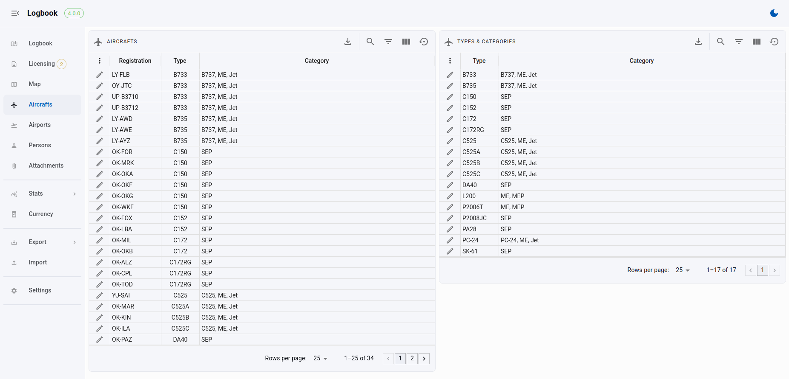

## Airports
- Airport database
- Custom airports
- Filters

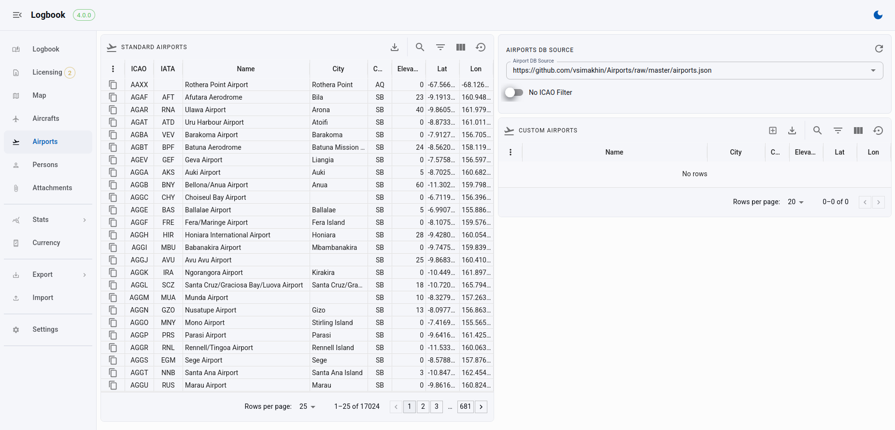

## Persons
- Persons list for the recorded flight records
- Flight list for each person
- Custom user defined roles (Captain, First officer, Crew etc)

## Stats
- Dashboard statistics
- Statistics by year, type, and category
- Custom field support

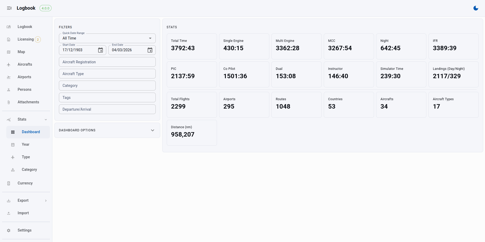
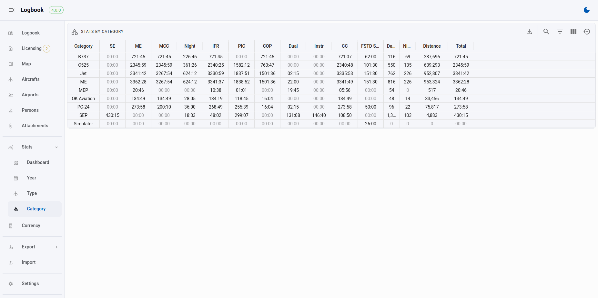

## Currency
- Tracking currency and flight experience
- Different time frames: days, calendar months, calendar years, since date and all time

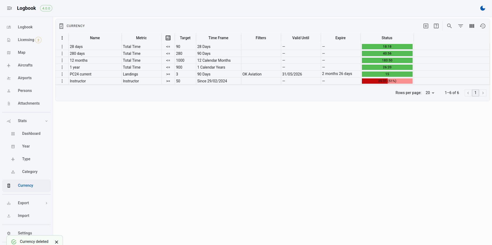

## Export
- Export to EASA PDF format (A4 and A5)
- PDF export formats with custom title pages (for example, include your CV automatically)
- Adjustable settings for each export format
- Instructor/Examiner signatures also included in the PDF export

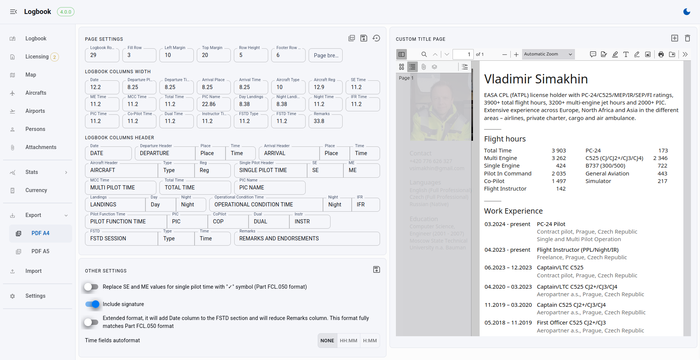

### A4
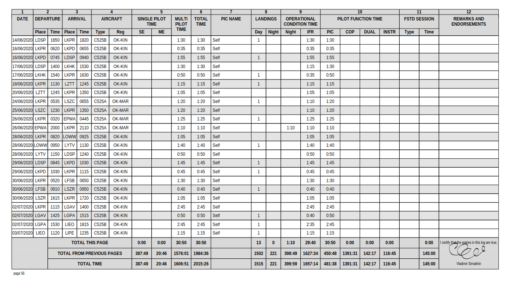

### A5
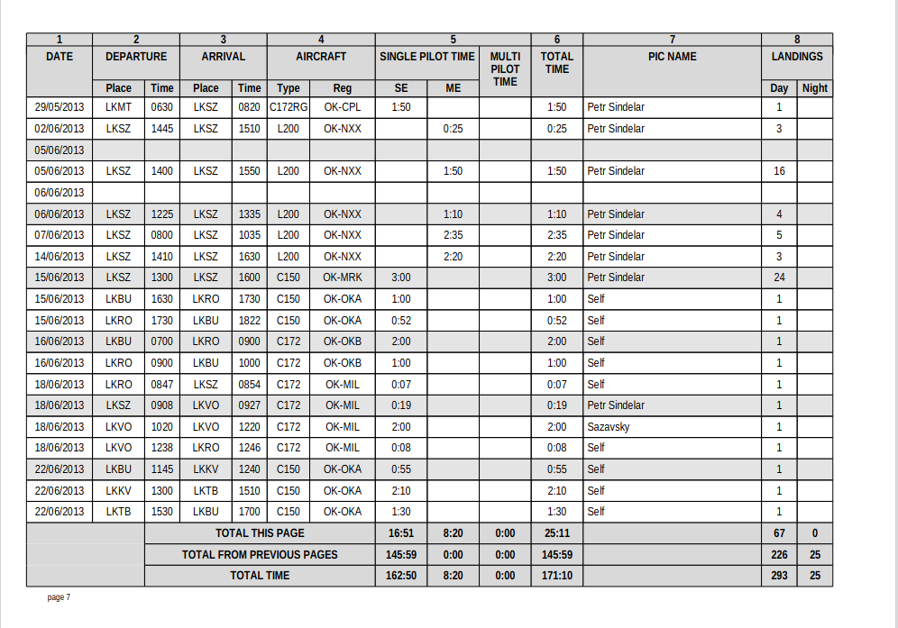
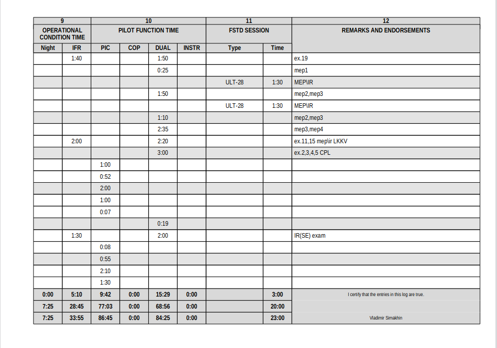

So in real life the logbook could look like
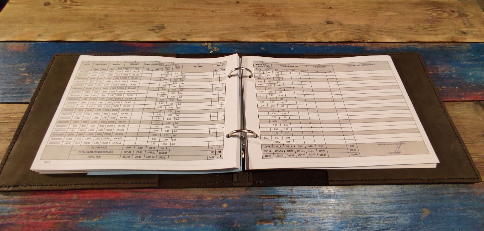

## Import
- CSV support
- Predefined formats
  - WebLogbook
  - Leon application (via export to CrewLounge link)
- Custom formats

## Settings
- Owner name, license and address, signature for the PDF exports
- Signature pad to automatically include signatures to the PDF exports
- Enable/Disable authentication (in case you need to expose the app to the public internet)
- Some interface settings
- Custom names for the standard flight record fields
- Custom fields for the Flight record

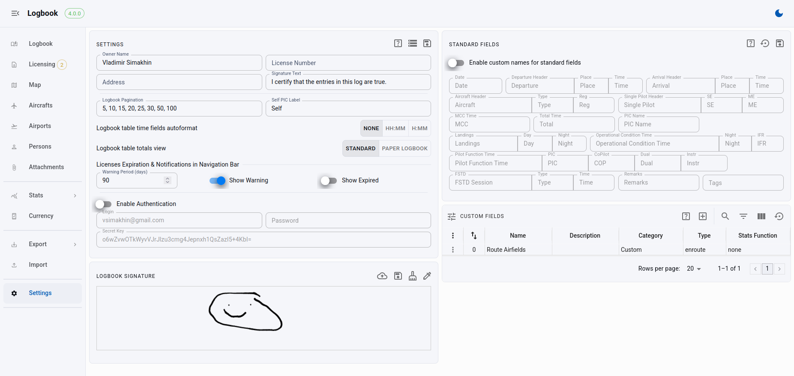

---

# Airports Databases

The app supports 3 sources:
- https://github.com/mwgg/Airports/raw/master/airports.json - main JSON database of 28k+ airports.
- (default) https://github.com/vsimakhin/Airports/raw/master/airports.json - my local fork of the main JSON database,  to ensure that the app remains functional even if there are any breaking changes in the upstream.
- https://davidmegginson.github.io/ourairports-data/airports.csv - an alternate set of airports from https://ourairports.com/, which contains over 78k records, including small airfields and heliports. 

If you enable the `No ICAO codes filter` option, the app will ignore ICAO airport codes that contain numbers and dashes, which are not commonly used ICAO codes. By default, this option is unchecked, which makes the database slightly smaller and cleaner.

---

# Advanced Configuration

## HTTPS enable

You can generate your own certificate and key and store it in the different directories in your operating system. For that use `--key` and `--cert` parameters to specify the exact location and run the app with `--enable-https` flag.

## MySQL database

**Disclaimer**: the main development is based on SQLite engine, so MySQL can potentially have some bugs. If you find one, please report in the issues.

To store all data, you can use MySQL database. To get started, create a database and a user with access to it. On the first run, the application will create all necessary tables and views. If you want to migrate your data from SQLite to MySQL, you can use the export to CSV function first and then import from CSV.

The DSN format for MySQL connections 
```
user:password@protocol(address)/dbname?param=value
```

For example, 
```
./web-logbook -engine mysql -dsn "web-logbook-user:pwd@tcp(192.168.0.222)/web-logbook"
```

## API

The backend exposes a REST (sort of) API for access to all logbook functionality. You can find the full list of the endpoints here https://github.com/vsimakhin/web-logbook/blob/main/app/routes.go#L26

### Authentication

If authentication is enabled you need to use Bearer token

```bash
# get token
TOKEN=$(curl -s -X POST http://127.0.0.1:4000/api/login -H "Content-Type: application/json" -d '{"login": "login", "password": "password"}' | jq -r '.token')

# run request
curl http://127.0.0.1:4000/api/export/A4 -H "Authorization: Bearer $TOKEN" --output logbook.pdf
```

PowerShell for Windows (generated by ChatGPT)
```powershell
$response = Invoke-RestMethod -Uri "http://127.0.0.1:4000/api/login" `
  -Method POST `
  -Headers @{ "Content-Type" = "application/json" } `
  -Body '{"login": "login", "password": "password"}'

$token = $response.token

Invoke-WebRequest -Uri "http://127.0.0.1:4000/api/export/A4" `
  -Headers @{ "Authorization" = "Bearer $token" } `
  -OutFile "logbook.pdf"
```

### API examples

Download PDF A4 logbook
```bash
curl http://127.0.0.1:4000/api/export/A4 --output logbook.pdf
```

Get distance between LKPR and EDDM airports in nautical miles
```bash
curl http://127.0.0.1:4000/api/distance/LKPR/EDDM
```

Get night time in minutes for the flight from LKPR departed at 1600 UTC to the EDDM with arrival at 2012 UTC on 27/09/2025
```bash
curl -s -X POST http://localhost:4000/api/logbook/night \
  -H "Content-Type: application/json" \
  -d '{
    "date": "27/09/2025",
    "departure": {
      "place": "LKPR",
      "time": "1600"
    },
    "arrival": {
      "place": "EDDM",
      "time": "2012"
    }
  }' | jq -r '.data'
```

---

# Contributing / New features / Issues

In case you'd like to add some other features to the logbook or you found a bug, please open an "issue" here https://github.com/vsimakhin/web-logbook/issues with a description. I cannot promise I'll implement it or fix it at a reasonable time but at least I can take a look.

---

# Contributors

Thanks for bug reports, testing, improvements, and features suggestions:

<p align="left">
  <a href="https://github.com/Jacopx" title="Jacopx"></a>
  <a href="https://github.com/dimoniet" title="dimoniet"></a>
  <a href="https://github.com/ghost" title="maesteve"></a>
  <a href="https://github.com/ken340" title="ken340"></a>
  <a href="https://github.com/morremeyer" title="morremeyer"></a>
  <a href="https://github.com/bbqman7089" title="bbqman7089"></a>
  <a href="https://github.com/danielkappelle" title="danielkappelle"></a>
  <a href="https://github.com/jvandergeer" title="jvandergeer"></a>
  <a href="https://github.com/eagleone84" title="eagleone84"></a>
  <a href="https://github.com/daman2k" title="daman2k"></a>
  <a href="https://github.com/fldroiddev" title="fldroiddev"></a>
  <a href="https://github.com/benoitfl" title="benoitfl"></a>
  <a href="https://github.com/Gaudv" title="Gaudv"></a>
  <a href="https://github.com/tumblebone" title="tumblebone"></a>
  <a href="https://github.com/marostegui" title="marostegui"></a>
  <a href="https://github.com/xtncl" title="xtncl"></a>
  <a href="https://github.com/leapparence" title="leapparence"></a>
  <a href="https://github.com/fuelflo" title="fuelflo"></a>
  <a href="https://github.com/chrp90" title="chrp90"></a>
  <a href="https://github.com/machullamanuel-cmyk" title="machullamanuel-cmyk"></a>
  <a href="https://github.com/AngusBell97" title="AngusBell97"></a>
  <a href="https://github.com/pedroponte" title="pedroponte"></a>
  <a href="https://github.com/benbox69" title="benbox69"></a>
  <a href="https://github.com/WildBlueUK" title="WildBlueUK"></a>
  <a href="https://github.com/Muchacho08" title="Muchacho08"></a>
</p>

--

# Tech stack

Backend:
* go-pdf https://codeberg.org/go-pdf/fpdf
* chi web-server https://github.com/go-chi/chi
* go-solar https://github.com/mstephenholl/go-solar
* sqlite https://modernc.org/sqlite
* mysql https://github.com/go-sql-driver/mysql
* golang-jwt https://github.com/golang-jwt/jwt/
* testify https://github.com/stretchr/testify

Frontend:
* ViteJS https://vite.dev/
* React https://react.dev/
* Material UI https://mui.com/material-ui/
* Material Toolpad core https://mui.com/toolpad/core/introduction/
* Openlayers https://openlayers.org/
* dayjs https://github.com/iamkun/dayjs
* TanStack Query https://tanstack.com/query/
* export-to-csv https://github.com/alexcaza/export-to-csv
* Signature Pad https://github.com/szimek/signature_pad
* PapaParse https://github.com/mholt/PapaParse
* compare-versions https://github.com/omichelsen/compare-versions
* file-type https://github.com/sindresorhus/file-type
* mapbox/togeojson https://github.com/mapbox/togeojson

---

# Star History

[](https://www.star-history.com/#vsimakhin/web-logbook&Date)

---

# License

This project is licensed under the MIT License - see the [LICENSE](LICENSE) file for details.
