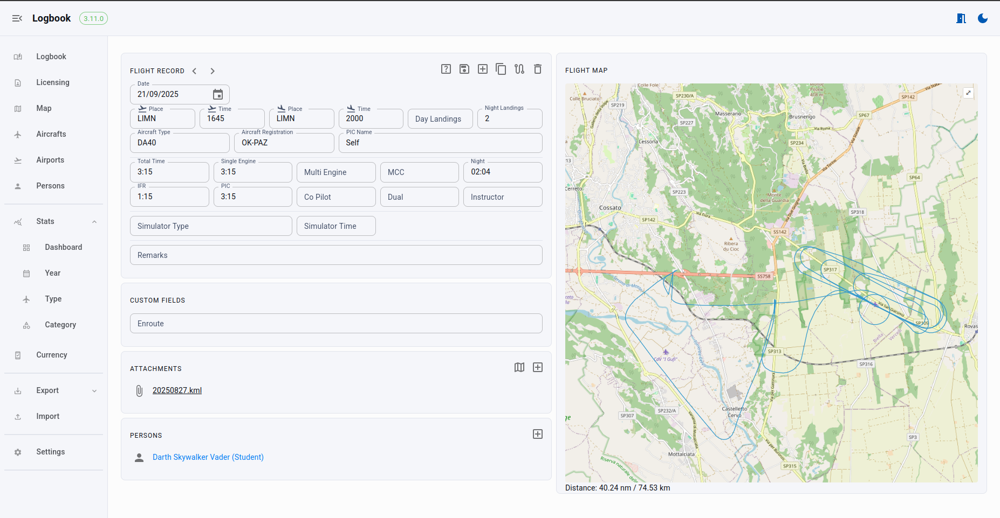

 
 
[](https://buymeacoffee.com/vsimakhin)


# Web-logbook

This is a simple, free and opensource EASA-style logbook application written in golang.

You can clone the repo and compile the binaries yourself, or just download the latest ones for your operating system from the [releases](https://github.com/vsimakhin/web-logbook/releases).

Once you start the app it automatically creates an SQLite local DB and starts listening on port 4000 by default. So you can open it in your standard web browser at http://localhost:4000

You also can easily export all flight records into EASA style pdf format, print it, sign and use it as a usual paper logbook.

# Changelog

## [2.35.2] - 20.05.2024

- Fix: Proper password field validation on Save
- Update: Support for submit button (on Enter key) on login page
- Fix: Add horizontal scrolling for the logbook page to properly support mobile devices
- Fix: Add dynamic resizing for the charts on Stats pages
- Fix: Instructor's hours for the Total Stats table were mixed up for the last 90 days and the last 12 months

## [2.35.1] - 20.05.2024

- Fix: Correct using styles and classes for the sidebar when switching between the pages
- Update: Code cleanup, removing code for synchronization with mobile client (will not continue working on it)
- Update: Update golang version (1.21.10) and go packages.

## [2.35.0] - 18.05.2024

- New: Implemented a new responsive user interface that is friendly for desktop, mobile, and tablet devices. The design is based on the adminkit.io template, and all pages are refactored to ensure a seamless user experience across different platforms. Probably some new bugs are introduced ¯\\_(ツ)_/¯*
- Update: rename cmd/web directory to app, just internal change.
- Update: Code optimization. No UI change. Includes:
    - Migrated all javascript code to a js files instead of keeping them in gohtml templates, plus some html code optimization. This significantly reduces amouunt of typo and errors. 
    - Removed map data for css and js files for standard libraries. As a result, the final size of the application binary file is reduced by ~10 MB to ~18MB.
    - Added simple brutforce protection for login page.
    - Optimize internal helper function, so need for additional error check.

## [2.34.0] - 03.04.2024

- New: Add support for MySQL database. Check [readme](https://github.com/vsimakhin/web-logbook?tab=readme-ov-file#mysql-database) for more details.
- Update: Refactored PDF export package. No UI changes.
- New: Add support for a custom title page for PDF A4/A5 exports.
- Update: Update openlayers lib from 7.3.0 to 9.0.0. No UI changes.
- Update: Update golang from 1.20.3 to 1.21.8. No UI changes.
- Fix: Finally fixed the unit tests. No UI changes.

## [2.33.0] - 08.03.2024

- New: License Number and Address fields on the `Settings` page. They are printed (if not empty) on the title page for PDF exported logbook.
- Fix: Try to fix a `Map` page layout for Mac OS

The full changelog is [here](https://github.com/vsimakhin/web-logbook/blob/main/CHANGELOG.md)

# Usage

1. Download the latest release from https://github.com/vsimakhin/web-logbook/releases
1. Extract the archive to some folder/directory
1. Run:
  * Windows:
    * Double-click on the `web-logbook.exe` file. It will show you some warning about how unsafe it can be (need to solve it later), but just run it.
  * Linux/MacOS:
    * Open a terminal and navigate to the directory
    * Run `./web-logbook`
4. Open your browser, type http://localhost:4000 and the application is ready to use
  * *(first run)* Go to the `Settings->Airports` page and click on the `Update Airport DB` button
6. To close the application, use `Ctrl+C` in the terminal window or just close it

## CLI options
```sh
$ ./web-logbook -h
  -cert string
      certificate path (default "certs/localhost.pem")
  -disable-authentication
      Disable authentication (in case you forgot login credentials)
  -dsn string
      Data source name {sqlite: file path|mysql: user:password@protocol(address)/dbname?param=value} (default "web-logbook.sql")
  -enable-https
      Enable TLS/HTTPS
  -engine string
      Database engine {sqlite|mysql} (default "sqlite")
  -env string
      Environment {dev|prod} (default "prod")
  -key string
      private key path (default "certs/localhost-key.pem")
  -port int
      Server port (default 4000)
  -url string
      Server URL (default empty - the app will listen on all network interfaces)
  -version
      Prints current version
```

# Supported operating systems

Since it's written in Golang, it can run on any system after compiling the sources. Currently, on the [Release](https://github.com/vsimakhin/web-logbook/releases/latest) page, there are binaries available for Linux, MacOS, and Windows.


# Interface

* Logbook
  * Flight records with date filter and global search through all data
  * Quick export to PDF (A4, A5) and CSV/XLS
* Flight records
  * Flight data
  * Attachments for the flight records
  * Automatic night-time calculation
  * Map drawing and distance calculation for the flight record
* Licensing & Certification
  * List of licenses, certificates and endorsements
  * Document attachments and preview
  * Expiration time tracking
* Map
  * Map of the flights
  * Date filters
  * Routes and airports filters
  * Aircraft filters
* Statistics
  * Totals
  * By Year
  * By Aircraft
  * By Aircraft group/class
  * Limits (EASA flight time limitations)
* Export
  * Export to EASA PDF format (A4 and A5)
  * PDF export formats with custom title pages (for example, include your CV automatically)
  * Additional export formats (XLSX, CSV)
  * Adjustable settings for each export format
* Import
  * CSV support
  * Automatic WebLogbook profile load
* Settings
  * Owner name, license and address, signature for the PDF exports
  * Signature pad to automatically include signatures to the PDF exports
  * Enable/Disable authentication (in case you need to expose the app to the public internet)
  * Aircraft groups/classes
  * Global airport database
  * Your own custom airfields or heliports
  * Some interface settings

## Logbook


## Flight record


## Licensing & Certification


## Map


## Stats example


## Export


### A4


### A5


So in real life the logbook could look like


## Import


## Settings


## Dark mode


## Mobile friendly


# Airports Databases

The app supports 3 sources:
* https://github.com/mwgg/Airports/raw/master/airports.json - main JSON database of 28k+ airports.
* (default) https://github.com/vsimakhin/Airports/raw/master/airports.json - my local fork of the main JSON database,  to ensure that the app remains functional even if there are any breaking changes in the upstream.
* https://davidmegginson.github.io/ourairports-data/airports.csv - an alternate set of airports from https://ourairports.com/, which contains over 78k records, including small airfields and heliports. 

If you enable the `No ICAO codes filter` option, the app will ignore ICAO airport codes that contain numbers and dashes, which are not commonly used ICAO codes. By default, this option is unchecked, which makes the database slightly smaller and cleaner.

# Advanced configuration
## HTTPS enable

Since the app is running on `localhost` it's not possible to create a public certificate that would be valid by public CAs. As an option, you can create a self-signed certificate and add it to the root CA in your operating system. For that, you can use [`mkcert` tool](https://github.com/FiloSottile/mkcert).

* Open a terminal/console and navigate to the `web-logbook` directory
* Create a directory `certs`
* In this new directory run commands:
  * `mkcert -instal` - it will create a new local CA
  * `mkcert localhost` - it will generate a key(`localhost-key.pem`) and a certificate(`localhost.pem`)
* Now just run the Web Logbook App with the new parameter: `web-logbook --enable-https`

You don't need to install a new local CA in you system, but in this case, browser will always show you a warning message, that certificate is self-signed and not trusted.

Also, you can always generate your own certificate and key and store it in the different directories in your operating system. For that use `--key` and `--cert` parameters to specify the exact location.

## MySQL database

To store all data, you can use MySQL database. To get started, create a database and a user with access to it. On the first run, the application will create all necessary tables and views. If you want to migrate your data from SQLite to MySQL, you can use the export to CSV function first and then import from CSV.

The DSN format for MySQL connections 
```
user:password@protocol(address)/dbname?param=value
```

For example, 
```
./web-logbook -engine mysql -dsn "web-logbook-user:pwd@tcp(192.168.0.222)/web-logbook
```

# New features/Issues

In case you'd like to add some other features to the logbook or you found a bug, please open an "issue" here https://github.com/vsimakhin/web-logbook/issues with a description. I cannot promise I'll implement it or fix it at a reasonable time but at least I can take a look.

<a href="https://www.buymeacoffee.com/vsimakhin" target="_blank"></a>

# Contributors

* [@Jacopx](https://github.com/Jacopx), [@dimoniet](https://github.com/dimoniet), [@maesteve](https://github.com/maesteve), [@ken340](https://github.com/ken340) - bug reports, testing, and new functionality suggestions

# Used libraries

* Adminkit.io https://adminkit.io (AdminKit PRO License Agreement for Hobby License - https://adminkit.io/licenses/)
* Bootstrap https://getbootstrap.com/
* Datatables https://datatables.net/
* Openlayers https://openlayers.org/
* Golang go-pdf https://github.com/go-pdf/fpdf
* Golang chi web-server https://github.com/go-chi/chi
* Golang Excelize https://github.com/xuri/excelize
* Chart.js https://www.chartjs.org/
* Date Range Picker https://www.daterangepicker.com/
* Signature Pad https://github.com/szimek/signature_pad
* PapaParse https://github.com/mholt/PapaParse
* arc.js https://github.com/springmeyer/arc.js
