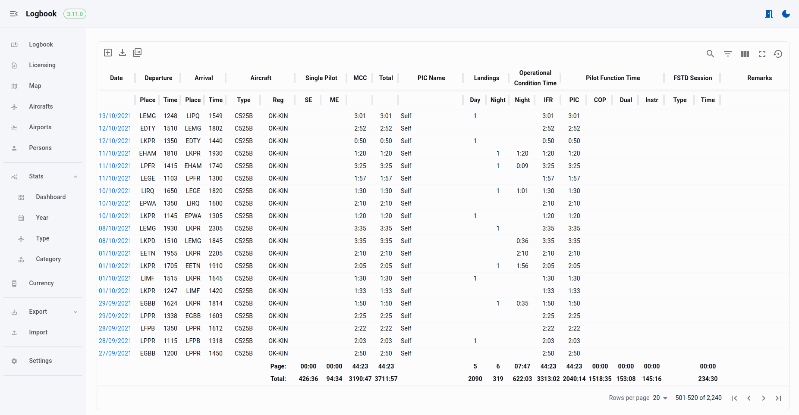
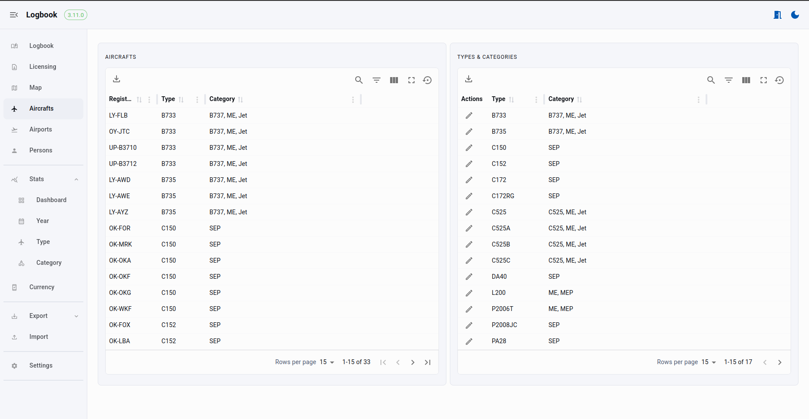
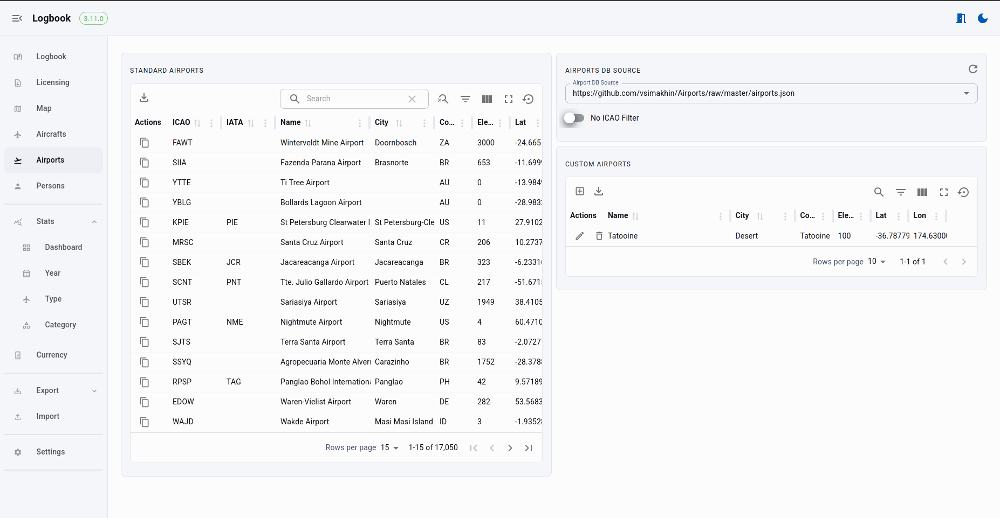
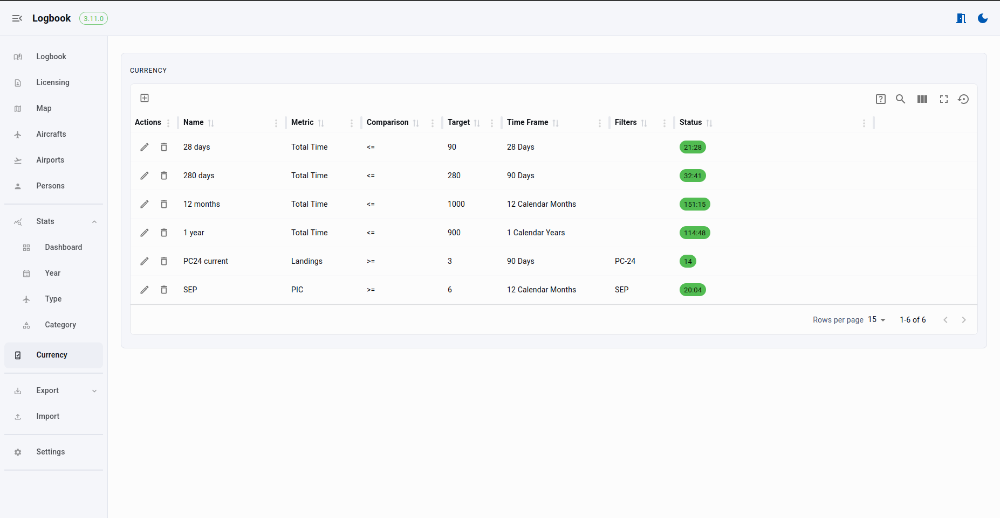

# Web-logbook

This is a simple, free and opensource EASA-style logbook application written in golang and react.

You can clone the repo and compile the binaries yourself, or just download the latest ones for your operating system from the [releases](https://github.com/vsimakhin/web-logbook/releases).

Once you start the app it automatically creates an SQLite local DB and starts listening on port 4000 by default. So you can open it in your standard web browser at http://localhost:4000

You also can easily export all flight records into EASA style pdf format, print it, sign and use it as a usual paper logbook.

# Changelog

## [Unreleased]

- New: Custom aircraft category linked to the registration number. All stats, filters and currency also supports new custom categories.

## [3.17.0] - 13.11.2025

- Update: Golang and npm packages/security patches
- Fix: Optimized the currency page to refresh the state after a flight record is updated.
- New: Add support for imports from Leon application.
- Fix: Flights for the selected person were shown in random order.

## [3.16.0] - 25.10.2025

- Fix: Error when building aircraft list if multiple aircraft types were logged under the same registration number.
- Update: Golang and npm packages/security patches
- Fix/Update: Simplified and corrected night time calculation. Previously, it could be inaccurate for routes on the opposite side of the globe from Europe.
- Fix: Night time field wasn't updated (for copied flights) if the actual night time was 0.

## [3.15.0] - 15.10.2025

- New: Add option to upload and download the database file (SQLite only).
- Fix: Update column number for the ICAO code for Our Airports database source.
- Fix: Recalculate night time even the field is not empty.
- New: Added an option to hide time fields on the Flight Record page.
- Update: Reorganized action buttons on the Flight Record page.
- Update: Set start of the week to Monday for the date fields
- New: Added badges on the navigation panel for very soon expiring and expired licenses, configurable from the Settings page.

## [3.14.0] - 07.10.2025

- New: Expiration date tracking for Currency - `Valid Until` and `Expire` @xtncl

The full changelog is [here](https://github.com/vsimakhin/web-logbook/blob/main/CHANGELOG.md)

## Old v2.x version
If you still would like to use v2.x version:
* Latest v2 release https://github.com/vsimakhin/web-logbook/releases/tag/v2.45.0
* Docker `docker pull vsimakhin/web-logbook:v2.45.0`

# Usage

1. Download the latest release from https://github.com/vsimakhin/web-logbook/releases
2. Extract the archive to some folder/directory
3. Run:
  * Windows:
    * Double-click on the `web-logbook.exe` file. It will show you some warning about how unsafe it can be (I don't digitally sing the binary), but just run it.
  * Linux/MacOS:
    * Open a terminal and navigate to the directory
    * Run `./web-logbook`
4. Open your browser, type http://localhost:4000 and the application is ready to use
5. To close the application, use `Ctrl+C` in the terminal window or just close it

## CLI options
```sh
$ ./web-logbook -h
  -cert string
      certificate path (default "certs/localhost.pem")
  -disable-authentication
      Disable authentication (in case you forgot login credentials)
  -dsn string
      Data source name {sqlite: file path|mysql: user:password@protocol(address)/dbname?param=value} (default "web-logbook.sql")
  -enable-https
      Enable TLS/HTTPS
  -engine string
      Database engine {sqlite|mysql} (default "sqlite")
  -env string
      Environment {dev|prod} (default "prod")
  -key string
      private key path (default "certs/localhost-key.pem")
  -port int
      Server port (default 4000)
  -url string
      Server URL (default empty - the app will listen on all network interfaces)
  -version
      Prints current version
```

# Supported Operating Systems and Requirements

Since it's written in Golang, it can run on any system after compiling the sources. Currently, on the [Release](https://github.com/vsimakhin/web-logbook/releases/latest) page, there are binaries available for Linux, MacOS, and Windows.

You can use any modern browser with JavaScript enabled to access the app.


# Interface

## Logbook
* Flight records table with filter for all fields and global search through all data
* Customized set of columns
* Quick export to CSV for all and filtered data
* Export to PDF (A4, A5) formats
* Automatic totals and subtotals calculation



* Dark mode and mobile friendly


## Flight Records
* Flight record data
* Attachments for the flight records
* Automatic night-time calculation
* Custom/user defined fields
* Flight map
  * KML and GPX track attachments support for SkyDemon and FlightRadar24 (check this tool [fr24-kml-splitter](https://github.com/morremeyer/fr24-kml-splitter) for flightradar24 tracks)
* Persons tracking


## Licensing & Certification
* List of licenses, certificates and endorsements
* Document attachments and preview
* Expiration tracking


## Map
* Flight map
* Date filters
* Routes and airports filters
* Aircraft filters
* Simple overal stats


## Aircrafts
* Aircraft list recorded in the logbook
* Types & user defined categories



## Airports
* Standard airports database (3 sources)
* Custom user defined airports and airfields
* Filters



## Persons
* Persons list for the recorded flight records
* Flight list for each person
* Custom user defined roles (Captain, First officer, Crew etc)

## Stats
* Dashboard with custom filters
* Stats by Year, Type and Category
* User defined fields support


## Currency
* Tracking currency and flight exprerience
* Different time frames: days, calendar months, calendar years, since date and all time



## Export
* Export to EASA PDF format (A4 and A5)
* PDF export formats with custom title pages (for example, include your CV automatically)
* Adjustable settings for each export format


### A4


### A5


So in real life the logbook could look like


## Import
* CSV support
* Predefined formats
  * WebLogbook
  * Leon application (via export to CrewLounge link)

## Settings
* Owner name, license and address, signature for the PDF exports
* Signature pad to automatically include signatures to the PDF exports
* Enable/Disable authentication (in case you need to expose the app to the public internet)
* Some interface settings
* Custom names for the standard flight record fields
* Custom fields for the Flight record


# Airports Databases

The app supports 3 sources:
* https://github.com/mwgg/Airports/raw/master/airports.json - main JSON database of 28k+ airports.
* (default) https://github.com/vsimakhin/Airports/raw/master/airports.json - my local fork of the main JSON database,  to ensure that the app remains functional even if there are any breaking changes in the upstream.
* https://davidmegginson.github.io/ourairports-data/airports.csv - an alternate set of airports from https://ourairports.com/, which contains over 78k records, including small airfields and heliports. 

If you enable the `No ICAO codes filter` option, the app will ignore ICAO airport codes that contain numbers and dashes, which are not commonly used ICAO codes. By default, this option is unchecked, which makes the database slightly smaller and cleaner.

# Advanced Configuration

## Docker & Kubernetes

Check [readme](./docker/README.md) for dockerized app for more details.

## HTTPS enable

You can generate your own certificate and key and store it in the different directories in your operating system. For that use `--key` and `--cert` parameters to specify the exact location and wun app with `--enable-https` flag.

## MySQL database

**Disclaimer**: the main development is based on SQLite engine, so MySQL can potentially have some bugs. If you find one, please report in the issues.

To store all data, you can use MySQL database. To get started, create a database and a user with access to it. On the first run, the application will create all necessary tables and views. If you want to migrate your data from SQLite to MySQL, you can use the export to CSV function first and then import from CSV.

The DSN format for MySQL connections 
```
user:password@protocol(address)/dbname?param=value
```

For example, 
```
./web-logbook -engine mysql -dsn "web-logbook-user:pwd@tcp(192.168.0.222)/web-logbook"
```

## API

The backend exposes a REST (sort of) API for access to all logbook functionality. You can find the full list of the endpoints here https://github.com/vsimakhin/web-logbook/blob/main/app/routes.go#L26

### Authentication

If authentication is enabled you need to use Bearer token

```bash
# get token
TOKEN=$(curl -s -X POST http://127.0.0.1:4000/api/login -H "Content-Type: application/json" -d '{"login": "login", "password": "password"}' | jq -r '.token')

# run request
curl http://127.0.0.1:4000/api/export/A4 -H "Authorization: Bearer $TOKEN" --output logbook.pdf
```

Powershel for Windows (generated by ChatGPT)
```powershell
$response = Invoke-RestMethod -Uri "http://127.0.0.1:4000/api/login" `
  -Method POST `
  -Headers @{ "Content-Type" = "application/json" } `
  -Body '{"login": "login", "password": "password"}'

$token = $response.token

Invoke-WebRequest -Uri "http://127.0.0.1:4000/api/export/A4" `
  -Headers @{ "Authorization" = "Bearer $token" } `
  -OutFile "logbook.pdf"
```

### API examples

Download PDF A4 logbook
```bash
curl http://127.0.0.1:4000/api/export/A4 --output logbook.pdf
```

Get distance between LKPR and EDDM airports in nautical miles
```bash
curl http://127.0.0.1:4000/api/distance/LKPR/EDDM
```

Get night time in minutes for the flight from LKPR departed at 1600 UTC to the EDDM with arrival at 2012 UTC on 27/09/2025
```bash
curl -s -X POST http://localhost:4000/api/logbook/night \
  -H "Content-Type: application/json" \
  -d '{
    "date": "27/09/2025",
    "departure": {
      "place": "LKPR",
      "time": "1600"
    },
    "arrival": {
      "place": "EDDM",
      "time": "2012"
    }
  }' | jq -r '.data'
```

# New features/Issues

In case you'd like to add some other features to the logbook or you found a bug, please open an "issue" here https://github.com/vsimakhin/web-logbook/issues with a description. I cannot promise I'll implement it or fix it at a reasonable time but at least I can take a look.

# Contributors

Thanks for bug reports, testing, improvements, and feature suggestions:

<p align="left">
  <a href="https://github.com/Jacopx" title="Jacopx"></a>
  <a href="https://github.com/dimoniet" title="dimoniet"></a>
  <a href="https://github.com/ghost" title="maesteve"></a>
  <a href="https://github.com/ken340" title="ken340"></a>
  <a href="https://github.com/morremeyer" title="morremeyer"></a>
  <a href="https://github.com/bbqman7089" title="bbqman7089"></a>
  <a href="https://github.com/danielkappelle" title="danielkappelle"></a>
  <a href="https://github.com/jvandergeer" title="jvandergeer"></a>
  <a href="https://github.com/eagleone84" title="eagleone84"></a>
  <a href="https://github.com/daman2k" title="daman2k"></a>
  <a href="https://github.com/fldroiddev" title="fldroiddev"></a>
  <a href="https://github.com/benoitfl" title="benoitfl"></a>
  <a href="https://github.com/Gaudv" title="Gaudv"></a>
  <a href="https://github.com/tumblebone" title="tumblebone"></a>
  <a href="https://github.com/marostegui" title="marostegui"></a>
  <a href="https://github.com/xtncl" title="xtncl"></a>
  <a href="https://github.com/leapparence" title="leapparence"></a>
</p>

# Used libraries

Backend:
* go-pdf https://codeberg.org/go-pdf/fpdf
* chi web-server https://github.com/go-chi/chi
* go-solar https://github.com/mstephenholl/go-solar
* sqlite https://modernc.org/sqlite
* mysql https://github.com/go-sql-driver/mysql
* golang-jwt https://github.com/golang-jwt/jwt/
* testify https://github.com/stretchr/testify

Frontend:
* ViteJS https://vite.dev/
* React https://react.dev/
* Material UI https://mui.com/material-ui/
* Material Toolpad core https://mui.com/toolpad/core/introduction/
* Material React Table https://material-react-table.com
* Openlayers https://openlayers.org/
* dayjs https://github.com/iamkun/dayjs
* TanStack Query https://tanstack.com/query/
* export-to-csv https://github.com/alexcaza/export-to-csv
* Signature Pad https://github.com/szimek/signature_pad
* PapaParse https://github.com/mholt/PapaParse
* arc.js https://github.com/springmeyer/arc.js
* compare-versions https://github.com/omichelsen/compare-versions
* file-type https://github.com/sindresorhus/file-type
* mapbox/togeojson https://github.com/mapbox/togeojson

## Star History

[](https://www.star-history.com/#vsimakhin/web-logbook&Date)
